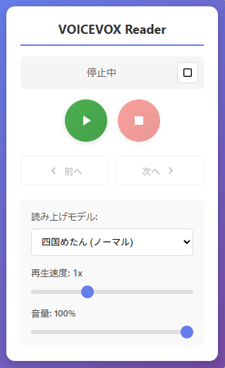
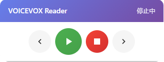

# VOICEVOX Reader

[](https://github.com/kokko-labs/voicevox-reader/actions/workflows/test.yml)

VOICEVOX を使用して Web ページの本文を読み上げる Chrome 拡張機能です。

## スクリーンショット

| ポップアップ | ページ上のフローティングパネル |
|---|---|
|  |  |

※ スクリーンショットの音声合成には「VOICEVOX:四国めたん」を使用しています。

## 機能

- 📖 **文章単位での読み上げ**: 本文を文章単位で最後まで順次読み上げます
- 🎯 **ハイライト表示**: 現在読み上げている文章を黄色でハイライト表示します
- 📝 **選択テキストの読み上げ**: 選択した範囲だけを読み上げるか、そこから続きを読み上げるかを選べます
- 🖱️ **右クリックメニュー**: 選択したテキストを、ポップアップを開かずにその場で読み上げられます
- 🎛️ **カスタマイズ**: 読み上げモデル、再生速度、音量を調整できます
- 🪟 **フローティングパネル**: ページ上に操作パネルを出し、ポップアップを開かずに操作できます
- 🔒 **読み上げは1タブのみ**: 別のタブで読み上げを始めると、前のタブは自動で停止します
- 📰 **リーダービュー対応**: Readability 系の HTML や簡易表示ページでも本文を優先して抽出します
- 🔍 **起動前チェック**: 読み上げ開始時に VOICEVOX の起動状態を確認します

## 必要条件

- **VOICEVOX**: ローカルで VOICEVOX のエンジンが動いている必要があります
  - ダウンロード: https://voicevox.hiroshiba.jp/
  - デフォルトの API エンドポイント: `http://localhost:50021`

必要なのはエンジンだけで、VOICEVOX のアプリ（エディタ）を開いたままにする必要はありません。
[エンジンだけを起動する](#エンジンだけを起動する)も参照してください。

## インストール方法

1. このフォルダをダウンロードまたはクローンします
2. Chrome で `chrome://extensions/` を開きます
3. 右上の「デベロッパーモード」を ON にします
4. 「パッケージ化されていない拡張機能を読み込む」をクリックします
5. このフォルダを選択します

## アイコン

読み上げの状態に応じて、ツールバーのアイコンの色が変わります。

| 状態 | 接頭辞 | 色 |
|------|--------|-----|
| 停止中 | `icon` | 紫 |
| 再生中 | `playing` | 緑 |
| 一時停止中 | `paused` | オレンジ |

`icons/` には各状態 × 3サイズ（16 / 48 / 128）の PNG が入っています。
生成元は `icons/src/` の SVG です。16px 版は縮小すると線が潰れるため、
線を太らせた専用の図形を使っています。

PNG を作り直すときは、Chromium 系ブラウザで SVG を描画します。

```bash
chrome --headless --disable-gpu --default-background-color=00000000 \
  --screenshot=icons/icon128.png --window-size=128,128 \
  file://$PWD/icons/src/icon128.svg
```

## 使い方

1. VOICEVOX を起動します
2. 読み上げたい Web ページを開きます
3. 拡張機能のアイコンをクリックしてポップアップを開きます
4. 読み上げモデル、再生速度、音量を設定します
5. 再生ボタンをクリックして読み上げを開始します

### テキスト選択からの読み上げ

テキストを選択した状態で再生すると、選択の仕方によって動作が変わります。

| 選択の仕方 | 動作 |
|---|---|
| 文の区切りをまたがない短い選択 | そこからページの最後まで読み上げます |
| 複数の文や段落にまたがる選択 | 選択した範囲だけを読み上げて停止します |

長い記事を途中から聞きたいときは数語だけ選択し、特定の段落だけ聞きたいときはその段落全体を選択してください。

範囲だけを読み上げる場合は、判定結果が分かるようページ内に通知を表示します。

### 右クリックメニューからの読み上げ

テキストを選択して右クリックすると、メニューに「選択範囲を読み上げる」が現れます。
ポップアップを開かずに読み上げを始められます。

こちらは選択の長さにかかわらず、**選択した範囲だけ**を読み上げます。
項目名で動作が決まっているため、上記の自動判定は行いません。

この経路ではポップアップが開いていないため、停止や一時停止の手段としてフローティングパネルを自動で表示します。

### フローティングパネル

ページ上に置ける操作パネルです。ポップアップを開かずに、前へ・再生・一時停止・停止・次へを操作できます。

ポップアップ右上のボタンで表示します。閉じるときはパネル右上の × を押してください。
読み上げ中は誤って操作手段を失わないよう、× を押せないようにしています。

パネルはページごとに、表示を指示したときだけ現れます。常時表示の設定はありません。
ページを移動したり再読み込みしたりすると消えるので、必要なページで都度表示してください。

ヘッダー部分をドラッグすると位置を動かせます。

## エンジンだけを起動する

VOICEVOX は GUI の**エディタ**と、HTTP サーバーである**エンジン**に分かれており、この拡張機能が使うのはエンジンだけです。
エディタはエンジンを子プロセスとして起動するため、エディタを閉じるとエンジンも終了します。
エンジンだけを起動すれば、エディタを開いたままにする必要がなくなります。

Windows なら `tools/start-engine.cmd` をダブルクリックしてください。
コンソール窓が開いてエンジンのログが流れます。`Ctrl+C` を押すか窓を閉じると終了します。

インストール先やオプションを変えるときは、ファイル先頭の2行を書き換えます。

```bat
set "ENGINE=C:\Program Files\VOICEVOX\vv-engine\run.exe"
set "OPTIONS=--use_gpu"
```

- `--use_gpu` が使えるかは環境によります。起動に失敗する場合は `OPTIONS` を空にしてください
- エディタと同じポート 50021 を使うため、エディタを開くときは先にエンジンを終了してください

## フォルダ構成

```
voicevox-reader/
├── manifest.json          # 拡張機能の定義（ルート必須）
├── src/
│   ├── background.js      # Service Worker（VOICEVOX APIとの通信、アイコン更新）
│   ├── content/
│   │   ├── content.js     # 本文抽出・読み上げ制御・ハイライト
│   │   └── content.css    # ハイライトとフローティングパネルのスタイル
│   └── popup/
│       ├── popup.html     # ポップアップUI
│       ├── popup.js
│       └── popup.css
├── icons/                 # 拡張機能アイコン（PNG）と、その生成元の SVG（src/）
├── scripts/build.js       # 配布用 dist/ を作るビルドスクリプト
├── tools/start-engine.cmd # VOICEVOX エンジンだけを起動する
├── docs/images/           # README 用のスクリーンショット
└── tests/                 # jsdomベースの自動テスト
```

## テスト

```bash
npm install
npm test
```

2つの組に分かれています。

| ファイル | 対象 |
|---------|------|
| `tests/run-content-tests.js` | 本文抽出、文章分割、ハイライト、読み上げフロー、フローティングパネル |
| `tests/run-popup-tests.js` | ポップアップの操作と表示状態 |

どちらも jsdom 上で実際のコードを動かし、`chrome` API と VOICEVOX への通信だけを差し替えています。

## ビルド（配布用）

開発中は、このフォルダをそのまま「パッケージ化されていない拡張機能」として読み込めます。
配布するときは、必要なファイルだけを `dist/` へ集めます。

```bash
npm run build     # dist/ を作る
npm run package   # dist/ を作り、ウェブストア用の zip まで作る
```

`node_modules/` や `tests/` は配布物に含まれません。
ビルド時に、`manifest.json` が参照するパスと、動的に注入するファイルが
すべて揃っているかを確認します。欠けていればビルドが失敗します。

## 設定

| 設定項目 | 説明 | 読み上げ中に変更したとき |
|---------|------|------------------------|
| 読み上げモデル | VOICEVOX の音声キャラクターとスタイルを選択 | 次の文から切り替わります |
| 再生速度 | 0.5x ～ 2.0x の範囲で調整可能 | その場で速度が変わり、次の文から本来の音声で合成されます |
| 音量 | 0% ～ 100% の範囲で調整可能 | その場で反映されます |

設定は保存され、次回以降も引き継がれます。
「前へ」「次へ」「一時停止」「再開」の操作でも、そのときの設定が反映されます。

読み上げモデルだけ次の文からになるのは、再生中の音声はすでに合成が終わっており、
声を差し替えられないためです。

## トラブルシューティング

### 「VOICEVOXに接続できません」と表示される

- VOICEVOX が起動しているか確認してください
- VOICEVOX のエンジンがポート 50021 で動作しているか確認してください
- 再生ボタンを押した際に確認メッセージが表示された場合は、VOICEVOX を起動してから再実行してください

### VOICEVOX アプリを開いたままにしたくない

エンジンだけを起動すれば、アプリは不要です。[エンジンだけを起動する](#エンジンだけを起動する)を参照してください。

なお、Chrome 拡張単体ではローカルアプリを直接起動できません。

### ページで動作しない

- 読み上げ用のスクリプトは、ポップアップで再生を押した時点でそのタブへ注入されます。常時読み込まれてはいません
- `chrome://` で始まるページや Chrome ウェブストアなど、拡張機能の実行が禁止されているページでは動作しません
- 上記に該当しない場合は、ページを再読み込みしてから再度お試しください

## VOICEVOX との関係および利用上の注意

本プロジェクトは、VOICEVOX 公式とは関係のない非公式の第三者製ツールです。
VOICEVOX 本体、音声モデルおよび音声ライブラリは本リポジトリに含まれていません。
利用者自身が別途 VOICEVOX を導入し、起動する必要があります。

生成音声を利用する際は、[VOICEVOX ソフトウェア利用規約](https://voicevox.hiroshiba.jp/term/)および使用する各音声ライブラリ・キャラクターの利用規約が適用されます。
必要なクレジット表記や商用・法人利用の条件は音声ライブラリごとに異なる場合があるため、[VOICEVOX 公式 Q&A](https://voicevox.hiroshiba.jp/qa/) と[音声ライブラリ利用規約一覧](https://github.com/VOICEVOX/voicevox_vvm/blob/main/TERMS.txt)を確認し、各規約に従って利用してください。

## ライセンス

MIT License（[LICENSE](LICENSE) を参照）
